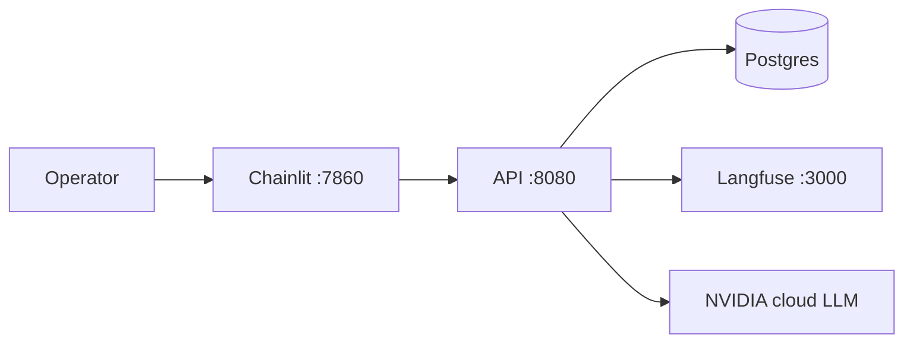

# Smart City Crisis Management AI

**Version 1.0** — multi-agent decision-support for city emergency operations teams.

**Deployment:** Docker Compose on an **NVIDIA GPU cloud instance** (Ubuntu). The stack runs entirely in containers; **LLM inference** uses **NVIDIA cloud models** via `integrate.api.nvidia.com` (one API key, different models per role).

## Documentation

| Document | Description |
|----------|-------------|
| [**Documentation index**](docs/README.md) | Full doc map (reviewed for workflow-only orchestration) |
| [**Docker deployment**](docs/DOCKER.md) | **Start here** — compose stack, Langfuse keys, troubleshooting |
| [Technical design v1.0](docs/TECHNICAL_DESIGN.md) | Architecture, models, security |
| [Product requirements](docs/REQUIREMENTS.md) | Acceptance criteria (Req 1–15) |
| [Specialist agents](docs/AGENTS.md) | Roles, YAML workflows, routing, code map |
| [Architecture diagrams](docs/diagrams/README.md) | Mermaid: deployment, pipeline, agent workflow |
| [Runbook v1.0](docs/RUNBOOK_v1.md) | Day-2 operations |
| [GPU host setup](docs/UBUNTU.md) | Ubuntu / Brev prerequisites before `make start` |
| [Demo incidents](data/examples/README.md) | Chainlit starter scenarios |

## Architecture (summary)



Full stack diagram: [docs/diagrams/deployment.mmd](docs/diagrams/deployment.mmd).

| Service | Port | Role |
|---------|------|------|
| **chainlit** | 7860 | Operator console — incident submit, per-recommendation approve/reject, submit |
| **api** | 8080 | FastAPI + LangGraph pipeline, SSE progress |
| **postgres** | 5432 | Incidents + Langfuse DB |
| **langfuse** (+ worker, clickhouse, redis, minio) | 3000 | Traces and eval UI |

## Quick start (GPU instance)

```bash
git clone <repo> && cd hkteam
cp .env.example .env
nano .env    # NVIDIA_API_KEY, Langfuse secrets, optional LANGFUSE_INIT_* 
make prerequisites   # first time on host
make start
```

From your laptop (Brev example):

```bash
brev port-forward <instance> --port 7860:7860 --port 8080:8080 --port 3000:3000
```

| URL | Service |
|-----|---------|
| http://localhost:7860 | Chainlit (operators) |
| http://localhost:8080/health | API health |
| http://localhost:3000 | Langfuse (traces) |

After Langfuse is up: create a **project** → **API Keys** → add `LANGFUSE_PUBLIC_KEY` / `LANGFUSE_SECRET_KEY` to `.env` → `make restart`.

```bash
make stop
make restart
make logs
make health
make verify-nvidia-api
```

## NVIDIA models (v1.0)

Configured in `configs/llm/multimodel.yaml` (`LLM_PROFILE=multimodel`). Enable each model on [build.nvidia.com](https://build.nvidia.com/) for your `NVIDIA_API_KEY`.

| Stage / agent | Profile | Model |
|---------------|---------|-------|
| Classifier, smart router, workflow selector | `cloud_nemotron_mini` | `nvidia/nemotron-mini-4b-instruct` |
| Specialists (flood, utilities, infrastructure, comms, …) | `cloud_nemotron_nano_8b` | `nvidia/llama-3.1-nemotron-nano-8b-v1` |
| Cyber | `cloud_mistral_7b` | `mistralai/mistral-7b-instruct-v0.3` |
| Public services | `cloud_phi_mini` | `microsoft/phi-4-mini-instruct` |
| Aggregator | `cloud_llama_70b` | `meta/llama-3.3-70b-instruct` |
| Incident critic | `cloud_nemotron_nano_8b` | `nvidia/llama-3.1-nemotron-nano-8b-v1` |

Details: [TECHNICAL_DESIGN §8.1](docs/TECHNICAL_DESIGN.md#81-nim-inference) · [AGENTS.md](docs/AGENTS.md).

## Specialist agents (workflow orchestration)

All **eight** specialists run **YAML-defined workflows** (`configs/agents/{id}.yaml`): tools, LLM steps, **parallel** branches, and **subagent** child workflows (e.g. flood dam breach invokes comms).

Smart Router picks up to **four** top-level specialists in parallel; each runs its own workflow pipeline.

Full catalog and action types: [docs/AGENTS.md](docs/AGENTS.md).

```env
CRISIS_MAX_SUBAGENT_DEPTH=2          # nested child agents in workflows
# CRISIS_AGENT_WORKFLOWS=flood:flood_critical   # optional overrides
```

## Operator flow

1. Submit incident (description + **location on last line**).
2. Watch **Crisis Response Command Center** pipeline (SSE).
3. Review **Recommendations** — approve or reject each card.
4. **Submit** to record decision and show **dispatch simulation** (simulation mode; no real external dispatch).

## Make commands

| Command | Description |
|---------|-------------|
| `make start` | Build and start full Docker stack |
| `make stop` | Stop stack |
| `make restart` | Restart after `.env` changes |
| `make test` | Host pytest with mock LLM (no Docker) |
| `make verify-nvidia-api` | Smoke-test cloud models |
| `make clean` | Remove containers **and volumes** |

## Optional: host-only development

For CI or quick tests without Docker:

```bash
make install
CRISIS_USE_MOCK_LLM=true make test
```

Production demos use **`make start` on the GPU instance** only.

## Requirements

Product requirements: [docs/REQUIREMENTS.md](docs/REQUIREMENTS.md)
