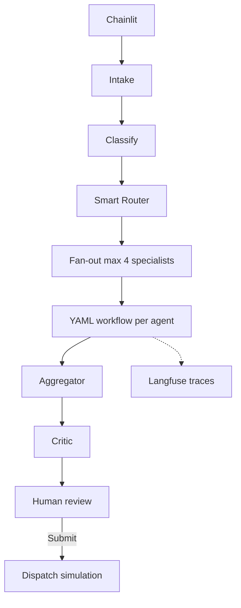
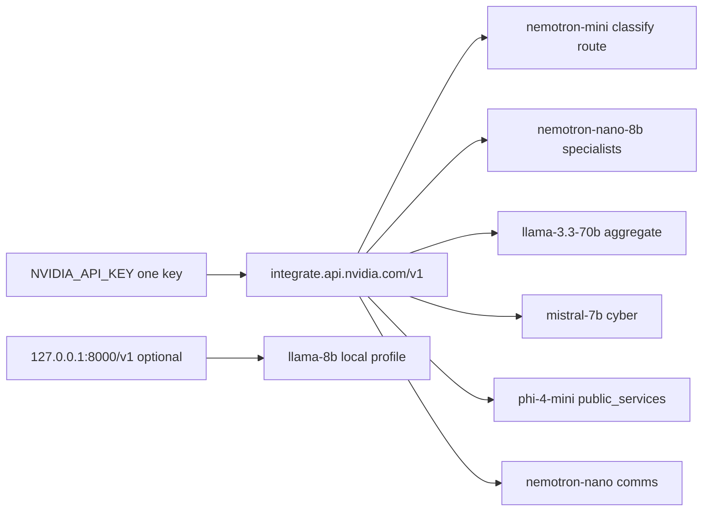

# Smart City Crisis Management AI — Technical Design

| Field | Value |
|-------|--------|
| **Version** | 1.0 |
| **Status** | Implemented (v1.0 application); see `docs/RUNBOOK_v1.md` |
| **Application** | `src/crisis/` v1.0.0 |
| **Primary OS** | Ubuntu 22.04+ on **NVIDIA GPU instance** (see `docs/UBUNTU.md`) |
| **Deployment** | **Docker Compose only** for production (`make start`) |
| **Product** | Smart City Crisis Management System |
| **Requirements** | `docs/REQUIREMENTS.md` |
| **Stack** | LangGraph · NVIDIA cloud LLM · Langfuse v3 · Chainlit · Postgres |
| **Inference** | Per-agent models on NVIDIA cloud (`LLM_PROFILE=multimodel`); optional local NIM on same host |
| **Agents guide** | `docs/AGENTS.md` · diagrams: `docs/diagrams/` (deployment, pipeline, orchestration, agent-workflow, models) |
| **Doc index** | `docs/README.md` (last reviewed 2026-05-18) |

---

## 1. Purpose

This document is the **build reference** for the Smart City Crisis Management application: a **human-in-the-loop**, multi-agent decision-support system for city emergency operations teams.

It consolidates product requirements, architecture decisions, and standard multi-agent patterns (LangGraph orchestration, per-agent workflows, RAG playbooks, human-in-the-loop governance).

**Out of scope for v1.0:** autonomous dispatch; live SCADA/CAD integrations; live NAT tool execution; mid-workflow switching inside a specialist run.

### 1.1 v1.0 implementation scope

| Area | v1.0 status |
|------|-------------|
| Intake, classify (rules), Smart Router (rules) | Implemented |
| Multi-specialist fan-out (parallel/sequential) | Implemented |
| Per-agent workflow selection | Implemented |
| Aggregator + HITL (API + Chainlit) | Implemented |
| **Docker Compose stack** | **Mandatory** — `make start` |
| **PostgreSQL** | **Mandatory** in Docker — incident persistence |
| **Langfuse v3** | Mandatory — `langfuse:3` + worker + ClickHouse + Redis + MinIO |
| YAML specialist workflows | **Required** — every agent has `configs/agents/{id}.yaml` (tools, LLM, parallel, subagent) |
| Subagent orchestration | `subagent` workflow action; `CRISIS_MAX_SUBAGENT_DEPTH` (default 2) |
| LLM | **`LLM_PROFILE=multimodel`** — NVIDIA cloud from `api` container |
| Host pytest | `make test` — mock LLM, no Docker (dev/CI only) |
| Local NIM | Optional on GPU host — `local_*` profiles in YAML (not in default compose) |

---

## 2. Goals and non-goals

### 2.1 Goals

- Accept incident reports (API + natural language), normalize and audit them.
- Classify incidents (category, severity, confidence).
- **Intelligently select** which specialist agents to run (one, several, or all *candidates*).
- Run **independent specialist subgraphs**, each choosing its own **workflow** and producing structured output.
- Aggregate outputs into one **Incident Summary** for a human operator.
- Require **explicit approval** before any external communication or action.
- Support **per-agent LLM configuration** (NVIDIA NIM cloud or local).
- Provide **full observability** and audit trail.

### 2.2 Non-goals (v1)

- Replacing human incident commanders or CAD systems.
- Hot-reload of `Agent_Config` / routing YAML without process restart (restart required; see §16).
- Mid-workflow switching inside a specialist run (planned future release; see §16).
- Unlimited parallel LLM agents on a single GPU (enforced caps).

---

## 3. Architecture overview

**Deployment (v1.0):** Docker Compose on an **NVIDIA GPU instance** — application containers plus Langfuse v3 backing services. LLM calls egress to **NVIDIA cloud**. Container map and traffic flows are in **§12.2**; diagram: `docs/diagrams/deployment.mmd`.

### 3.1 Layered system

```text
┌─────────────────────────────────────────────────────────────────────────┐
│  Presentation: Chainlit ops UI + REST API clients                           │
├─────────────────────────────────────────────────────────────────────────┤
│  API Gateway: auth (RBAC), rate limits, incident CRUD                     │
├─────────────────────────────────────────────────────────────────────────┤
│  Incident Orchestrator (LangGraph):                                       │
│    Intake → Classify → Smart Router → Fan-out → Join → Aggregate →        │
│    Critic → Human Review (interrupt) → [Approved Dispatch]                │
├─────────────────────────────────────────────────────────────────────────┤
│  Specialist subgraphs (per agent):                                        │
│    Workflow Selector → Agent Workflow (actions/skills) → Checks → Output  │
├─────────────────────────────────────────────────────────────────────────┤
│  Platform: Skills registry · Knowledge Base · NAT runners · NIM clients   │
├─────────────────────────────────────────────────────────────────────────┤
│  Observability: Langfuse · audit store · health endpoints                 │
└─────────────────────────────────────────────────────────────────────────┘
```

### 3.2 End-to-end flow

Canonical diagram: **`docs/diagrams/pipeline.mmd`**. Two-level orchestration (router + per-agent workflows): **`docs/diagrams/orchestration.mmd`**.



### 3.3 Design principles

| Principle | Implementation |
|-----------|----------------|
| Human decision maker | No outbound dispatch without approval |
| Rules before LLM | Router, classifier hints, workflow selection |
| Evidence-bound outputs | Citations from tool/KB results required |
| Separation of concerns | Smart Router = *who*; Agent = *how* |
| Fail partial, not silent | Aggregator includes failed/timed-out agents |
| Audit everything | Incident lifecycle + per-action traces |
| Dispatch isolation | Separate service + IAM from orchestrator |

---

## 4. Component specifications

### 4.1 Intake (service, not LLM agent)

**Responsibility:** Validate, normalize, assign `incident_id`, persist original report.

| Item | Detail |
|------|--------|
| Input | `IncidentReport` (JSON or NL parsed to JSON) |
| Required fields | `description` (non-empty), `location` (non-empty) |
| Output | `Incident` canonical object |
| SLA | Normalize within 5s (Req 1) |
| ID | System-generated, non-reusable unique ID (Req 1.5) |
| Failure | Queue + retry if classifier unavailable (Req 1.7) |

**Implementation:** FastAPI handler + Pydantic validation. No LLM on happy path.

### 4.2 Classifier (rules + LLM node)

**Responsibility:** Assign categories, severity, confidence, routing hints.

| Item | Detail |
|------|--------|
| Categories | `FLOOD`, `INFRASTRUCTURE`, `CYBER`, `PUBLIC_SAFETY`, `PUBLIC_SERVICES`, `UTILITIES`, `OTHER` |
| Severity | `LOW`, `MEDIUM`, `HIGH`, `CRITICAL` |
| Confidence | 0.0–1.0 per category |
| Low confidence | If all category confidence &lt; 0.6 → flag human before routing (Req 2.4) |
| Hints | Rule extractors: keywords (`dam`, `ransomware`, `hospital`), optional NER later |

**Pipeline:**

1. Rule-based pre-classification (fast, auditable).
2. Schema-constrained LLM classification when rules incomplete.
3. Log decision to observability platform (Req 2.6).

### 4.3 Smart Router (intelligent selection layer)

Sits **between** classifier and specialist fan-out. Answers: **which specialists to run** (one / several / all *candidates*).

#### 4.3.1 Two-stage routing

```text
Stage A (deterministic):  categories → Candidate_Set  (category_map + severity policy)
Stage B (smart):          Candidate_Set → Selected_Set (+ Deferred_Set, execution_mode)
```

#### 4.3.2 Selection modes

| Mode | When | Selected agents |
|------|------|-----------------|
| `minimal` | LOW severity or low confidence | 1 primary (+ optional comms on CRITICAL) |
| `targeted` | Clear domain signals | Subset of candidates |
| `full` | CRITICAL + multi-category + confidence ≥ threshold | All candidates + comms |
| `override` | Human operator | Explicit list |

#### 4.3.3 Decision algorithm

```text
1. candidates ← category_map(incident.categories)
2. candidates ← candidates ∪ always_for_severity(incident.severity)
3. Apply dependency_rules(incident) → may add/remove from candidates
4. If confidence < 0.6:
     selected ← [primary_agent]; flag_human; mode ← minimal
   Else if severity == CRITICAL and meets full_activation_criteria:
     selected ← candidates; mode ← full
   Else if dependency_rules produced explicit set:
     selected ← rule_result; mode ← targeted
   Else:
     selected ← llm_router_select(candidates)  # schema enum subset only
5. Apply max_parallel_agents cap
6. deferred ← candidates - selected
7. Emit RoutingDecision (audit)
```

**Safety:** `PUBLIC_SAFETY` in candidates cannot be dropped by LLM (Req alignment). `workflow_override` from human forces agent list.

See `configs/smart_routing/` for rule and dependency examples.

### 4.4 Fan-out executor

**Responsibility:** Invoke each selected specialist subgraph with a `RouterHandoff`.

| Execution | Policy |
|-------------|--------|
| `parallel` | CRITICAL default; independent domains |
| `sequential` | LOW/MEDIUM or dependency chain; pass `prior_outputs` to later agents |

**LangGraph:** Use dynamic `Send` API — one send per `agent_id` in `Selected_Set`.

**Timeouts:** Per-agent (45–60s per requirements); one retry (Req 15); then `status: timeout|failed`.

### 4.5 Specialist agent (subgraph)

Each specialist is a **LangGraph subgraph**, not a single prompt.

#### 4.5.1 Internal flow

```text
START → select_workflow → run_workflow → agent_checks → package_output → END
```

| Step | Description |
|------|-------------|
| `select_workflow` | Agent chooses `workflow_id` from `RouterHandoff` (rules-first, optional LLM) |
| `run_workflow` | Execute configured actions (tools, rules, LLM, NAT) |
| `agent_checks` | Schema, citations, policy (stricter for PUBLIC_SAFETY) |
| `package_output` | Emit `SpecialistOutput` JSON |

#### 4.5.2 Router handoff contract

```python
class RouterHandoff(BaseModel):
    incident_id: str
    categories: list[str]
    severity: SeverityLevel
    location: LocationRef
    description: str
    confidence: float
    routing_hints: list[str]
    priority: int | None
    prior_outputs: dict[str, SpecialistOutput]
    constraints: list[str]          # e.g. "restricted_mode"
    activated_reason: str
    workflow_override: str | None   # human only
```

#### 4.5.3 Agent workflow (roles, skills, actions)

Each agent defines:

- **Role** — organizational function (`flood_coordinator`, `cyber_lead`, …)
- **Skills** — registered capabilities (`weather_api`, `playbook_rag`, …)
- **Workflows** — named action pipelines (`flood_standard`, `flood_dam_breach`, …)
- **Actions** — steps: `tool`, `llm`, `parallel`, `subagent`, `rule`, `critic`, `nat_workflow` (see `docs/AGENTS.md`)

Workflow selection:

```text
1. If workflow_override: use it
2. Else apply workflow_selector rules (hints, severity, prior_outputs)
3. Else optional LLM selector (enum of registered workflow_ids only)
4. If confidence < 0.6: default workflow + flag
```

See `configs/agents/*.yaml`, `docs/AGENTS.md`, and §6 below.

#### 4.5.4 Specialist catalog

Full tables (YAML files, LLM profiles, selector rules): **`docs/AGENTS.md`**.

| agent_id | Role | Example workflows |
|----------|------|-------------------|
| `flood` | flood_coordinator | `flood_light`, `flood_standard`, `flood_critical`, `flood_dam_breach` (+ subagent comms) |
| `utilities` | utilities_coordinator | `utilities_standard`, `utilities_hospital_priority` |
| `infrastructure` | infrastructure_coordinator | `infra_standard` |
| `cyber` | cyber_coordinator | `cyber_containment`, `cyber_monitoring` |
| `comms` | comms_coordinator | `comms_standard` |
| `public_safety` | eoc_safety_liaison | `public_safety_restricted`, `public_safety_critical` |
| `public_services` | service_continuity_lead | `services_standard`, `services_disruption` |
| `general` | fallback_analyst | `general_triage` |

**Workflow execution:** Each specialist always runs `run_specialist()` → `run_agent_workflow()` from YAML. Actions include `tool`, `llm`, `parallel`, `subagent`, `critic`, `rule`, `nat_workflow` (stub). Child agents capped by `CRISIS_MAX_SUBAGENT_DEPTH`. See `docs/AGENTS.md`.

#### 4.5.5 Specialist output contract

```python
class SpecialistOutput(BaseModel):
    agent_id: str
    workflow_id: str
    workflow_selection_rationale: str
    recommendations: list[Recommendation]
    communication_drafts: list[CommunicationDraft]
    evidence: list[Evidence]
    checks_passed: bool
    check_notes: list[str]
    confidence: float
    duration_ms: int
    status: Literal["complete", "partial", "failed", "timeout"]
```

`Recommendation` and `CommunicationDraft` must reference `evidence_ids` where factual claims are made.

### 4.6 Aggregator

**Responsibility:** Fan-in all `SpecialistOutput` → single `IncidentSummary`.

| Behavior | Detail |
|----------|--------|
| Merge | Rank recommendations by severity + confidence |
| Conflicts | Detect contradictory actions (e.g. evacuate vs keep road open) |
| Partial | Include failed agents explicitly (Req 10.4) |
| Comms | Optionally invoke `comms` agent workflow on merged facts |
| SLA | Present within 10s of last agent completion (Req 10.3) |

### 4.7 Incident critic (verifier node)

**Responsibility:** Policy check on aggregated summary before human review.

- Required sections present
- No uncited critical claims
- PUBLIC_SAFETY wording matches template policy
- Max 2 revision loops → finalize with disclaimer if still failing

Implementation: `incident_critic` node — policy checks on aggregated summary before human review (max two revision loops).

### 4.8 Human-in-the-loop

**LangGraph:** `interrupt_before = ["human_review"]`

| Operator action | System behavior |
|-----------------|-----------------|
| Approve recommendation | Audit timestamp + operator ID (Req 11.2) |
| Reject | Record reason; optional re-run request (Req 11.3) |
| Edit comms draft | Store original + modified (Req 11.4) |
| Approve dispatch | Hand off to Dispatch Service only |

**UI (Chainlit v1.0):** Per-recommendation **Approve** / **Reject** cards; **Approve all** / **Reject all** do not submit; only **Submit** posts the decision and shows dispatch simulation (`SIMULATION_MODE`). After a decision on a card, only **Undo Approve** or **Undo Reject** is shown.

### 4.9 Dispatch service (isolated)

Separate module/service. Accepts only **signed, human-approved** payloads.

- Adapters: email, SMS gateway, ticketing (stubs in v1.0; simulation mode)
- No direct LangGraph → external API path

### 4.10 Escalation

| Trigger | Behavior |
|---------|----------|
| Specialist requests escalation | Re-enter Smart Router with `prior_outputs` |
| Dependency rule | Activate deferred agent |
| Depth cap | Max 3 escalation chains (Req 14.3) |
| Human notify | Reason + newly activated agents (Req 14.4) |

---

## 5. Data models

### 5.1 Core types

```python
class SeverityLevel(str, Enum):
    LOW = "LOW"
    MEDIUM = "MEDIUM"
    HIGH = "HIGH"
    CRITICAL = "CRITICAL"

class Category(str, Enum):
    FLOOD = "FLOOD"
    INFRASTRUCTURE = "INFRASTRUCTURE"
    CYBER = "CYBER"
    PUBLIC_SAFETY = "PUBLIC_SAFETY"
    PUBLIC_SERVICES = "PUBLIC_SERVICES"
    UTILITIES = "UTILITIES"
    OTHER = "OTHER"

class IncidentReport(BaseModel):
    description: str
    location: str
    reporter: str | None = None
    channel: str | None = None
    attachments: list[str] = []

class Incident(BaseModel):
    incident_id: str
    description: str
    location: LocationRef
    categories: list[Category]
    severity: SeverityLevel
    confidence: float
    routing_hints: list[str]
    created_at: datetime
    original_report: IncidentReport
    status: IncidentStatus

class RoutingDecision(BaseModel):
    incident_id: str
    candidates: list[str]
    selected: list[str]
    deferred: list[str]
    selection_mode: Literal["minimal", "targeted", "full", "override"]
    execution_mode: Literal["parallel", "sequential"]
    rationale: str
    confidence: float

class IncidentSummary(BaseModel):
    incident_id: str
    categories: list[Category]
    severity: SeverityLevel
    agent_outputs: dict[str, SpecialistOutput]
    ranked_recommendations: list[Recommendation]
    communication_drafts: list[CommunicationDraft]
    conflicts: list[ConflictNote]
    agents_failed: list[str]
    ready_for_human_review: bool
```

### 5.2 Incident graph state (LangGraph)

```python
class IncidentState(TypedDict, total=False):
    incident: Incident
    routing_decision: RoutingDecision
    specialist_outputs: dict[str, SpecialistOutput]
    incident_summary: IncidentSummary
    human_decision: HumanDecision | None
    escalation_depth: int
    trace: list[str]
```

---

## 6. Agent workflow schema

### 6.1 Action types

| type | Purpose |
|------|---------|
| `tool` | Invoke skill from registry |
| `llm` | `draft_recommendation` skill (structured Markdown output) |
| `parallel` | Run `params.steps` concurrently (tools/llm) |
| `subagent` | Run another agent’s workflow (`params.agent_id`, optional `workflow`) |
| `rule` | Deterministic if/then |
| `critic` | Validate prior LLM output vs evidence |
| `nat_workflow` | Delegate to NAT YAML (stub in v1.0) |

### 6.2 Example agent config (excerpt)

```yaml
# configs/agents/flood.yaml (excerpt)
agent_id: flood
workflow_selection:
  default: flood_standard
  rules_file: flood_selector_rules.yaml
workflows:
  flood_standard:
    actions:
      - { id: kb, type: tool, skill: playbook_rag, params: { tags: [flood] } }
      - id: context
        type: parallel
        params:
          steps:
            - { id: weather, type: tool, skill: weather_api }
            - { id: zone, type: tool, skill: flood_zone_gis }
        depends_on: [kb]
      - { id: analyze, type: llm, skill: draft_recommendation, input_from: [kb, context] }
      - { id: verify, type: critic, rules: [require_citations] }
  flood_dam_breach:
    inherits: flood_critical
    actions:
      - id: comms
        type: subagent
        params: { agent_id: comms, workflow: comms_standard }
        depends_on: [analyze]
```

### 6.3 Skills registry

Central `configs/skills/registry.yaml` maps skill IDs to handlers, timeouts, and `allowed_roles`.

---

## 7. LangGraph implementation

### 7.1 Graph structure

```text
incident_graph:
  nodes:
    - intake_validate
    - classify
    - smart_route
    - fan_out_agents      # dynamic Send
    - join_agent_results
    - aggregate
    - incident_critic
    - human_review        # interrupt
    - dispatch            # only on resume with approval
  edges:
    intake_validate → classify → smart_route → fan_out_agents
    fan_out_agents → join_agent_results → aggregate → incident_critic → human_review
    human_review → dispatch | END
```

### 7.2 Specialist subgraph template

```text
specialist_subgraph(agent_id):
  select_workflow → run_workflow → agent_checks → package_output
```

Workflow bodies loaded from `configs/agents/*.yaml` at runtime (`workflow_engine.py`). Incident-level graph is implemented in `pipeline/runner.py` with parallel specialist fan-out.

### 7.3 Checkpointing

- **Store:** PostgreSQL or Redis (LangGraph checkpointer)
- **Key:** `thread_id = incident_id`
- **Resume:** After partial failure or process restart (Req 15.4)

### 7.4 Streaming

- API exposes SSE/WebSocket for ops console
- Stream events: `classified`, `routed`, `agent_started`, `agent_completed`, `summary_ready`, `awaiting_human`
- Implemented: `POST /incidents/stream` SSE for Chainlit pipeline progress

---

## 8. NVIDIA stack integration

### 8.1 NIM (inference)

- Client: `langchain_nvidia_ai_endpoints.ChatNVIDIA`
- Endpoints:
  - **Cloud (primary):** `https://integrate.api.nvidia.com/v1` + `NVIDIA_API_KEY`
  - **Local (optional):** `http://127.0.0.1:8000/v1` on GPU instance (typically one small NIM)
- Per-agent `Agent_Config`: `base_url`, `model_name`, temperature, max tokens (see `configs/llm/multimodel.yaml`)
- **Same cloud API, different models per agent:** one `NIM_CLOUD_BASE_URL` + one `NVIDIA_API_KEY`; each agent gets its own `ChatNVIDIA(model=...)` instance.

#### 8.1.1 Inference architecture (decided)

The application runs on an **NVIDIA GPU instance** for LangGraph, Chainlit, Langfuse, and Postgres. **LLM inference** uses **NVIDIA cloud** with a **different model per role/agent** on the same API endpoint (`NIM_CLOUD_BASE_URL`). Optionally, **one small local NIM** on the instance serves agents assigned to a `local_*` profile (see `configs/llm/local.yaml`).

**Configuration file:** `configs/llm/multimodel.yaml` (selected by `LLM_PROFILE=multimodel` in `.env`).

**API key:** One `NVIDIA_API_KEY` (`nvapi-...`) for the whole stack — **not** one key per model. On [build.nvidia.com](https://build.nvidia.com/), open each model page you need and accept / try the model so your account can call it with that key. Verify with `make verify-nvidia-api` or `GET https://integrate.api.nvidia.com/v1/models`.

#### 8.1.2 Model profiles (`configs/llm/multimodel.yaml`)

Profiles are reusable client settings (`base_url`, `model`, temperature, `max_tokens`). Assignments point roles/agents at a profile.

| Profile ID | NVIDIA model ID | Typical use |
|------------|-----------------|-------------|
| `cloud_nemotron_mini` | `nvidia/nemotron-mini-4b-instruct` | Fast routing / classification |
| `cloud_nemotron_nano_8b` | `nvidia/llama-3.1-nemotron-nano-8b-v1` | Specialist agents (flood, utilities, …) |
| `cloud_llama_70b` | `meta/llama-3.3-70b-instruct` | Aggregator (merge specialist outputs) |
| `cloud_mistral_7b` | `mistralai/mistral-7b-instruct-v0.3` | Cyber specialist |
| `cloud_phi_mini` | `microsoft/phi-4-mini-instruct` | public_services (Phi-3 not on current catalog) |
| `cloud_nemotron_super` | `nvidia/llama-3.3-nemotron-super-49b-v1.5` | Defined, not assigned in v1.0 (optional upgrade) |
| `local_llama_8b` | `meta/llama-3.1-8b-instruct` | Optional local NIM (`NIM_LOCAL_BASE_URL`) |

**Embeddings (v1.0):** `embeddings.provider: none` — RAG is not wired; no embedding calls at runtime. Planned model when enabled: `nvidia/nv-embed-v1` (on build.nvidia.com; not `nv-embedqa-e5-v5` for new deployments).

#### 8.1.3 Where each model is used (assignments)

| Pipeline stage / agent | Profile | NVIDIA model ID | Code path |
|------------------------|---------|-----------------|-----------|
| Classifier | `cloud_nemotron_mini` | `nvidia/nemotron-mini-4b-instruct` | Incident classification (rules + LLM) |
| Smart router LLM | `cloud_nemotron_mini` | same | `smart_route` — subset of specialist agents |
| Workflow selector (default) | `cloud_nemotron_mini` | same | `select_workflow()` per agent |
| **Aggregator** | `cloud_llama_70b` | `meta/llama-3.3-70b-instruct` | `node_aggregate` — incident summary |
| Incident critic | `cloud_nemotron_nano_8b` | `nvidia/llama-3.1-nemotron-nano-8b-v1` | Critic / verification steps |
| Specialist **flood** | `cloud_nemotron_nano_8b` | same | `run_specialist` → `workflow_engine` |
| Specialist **utilities** | `cloud_nemotron_nano_8b` | same | Example 02 (flood + utilities) |
| Specialist **infrastructure** | `cloud_nemotron_nano_8b` | same | `configs/agents/infrastructure.yaml` |
| Specialist **public_safety** | `cloud_nemotron_nano_8b` | same | `configs/agents/public_safety.yaml` |
| Specialist **general** | `cloud_nemotron_nano_8b` | same | `configs/agents/general.yaml` |
| Specialist **cyber** | `cloud_mistral_7b` | `mistralai/mistral-7b-instruct-v0.3` | `configs/agents/cyber.yaml` |
| Specialist **public_services** | `cloud_phi_mini` | `microsoft/phi-4-mini-instruct` | `configs/agents/public_services.yaml` |
| Specialist **comms** | `cloud_nemotron_nano_8b` | same | Router adds for HIGH/CRITICAL; subagent from flood |

**Example 02** (flood + utilities) invokes at minimum: **nemotron-mini** (classify/route), **nemotron-nano-8b** (flood + utilities specialists), **llama-3.3-70b** (aggregate).

**Local — optional second endpoint** (`LLM_PROFILE=local` or override utilities to `local_llama_8b`):

| Agent | Endpoint | Model |
|-------|----------|-------|
| All agents (local profile) | `http://127.0.0.1:8000/v1` | `meta/llama-3.1-8b-instruct` |

**Observability:** Langfuse spans tag `agent_id`, `llm_profile`, `llm_model`, and `llm_provider` (`cloud` \| `local`) per specialist invoke.

**GPU instance:** hosts the application stack and optional local NIM; large models (e.g. 70B aggregator) stay on cloud unless explicitly reassigned.

**Per-agent override:** `configs/agents/<agent>.yaml` may set `llm.profile` or inline `llm.model` to override the global assignment map (future).

#### 8.1.4 Optional air-gapped / full-local deployment

For environments that cannot use cloud inference, use `configs/llm/local.yaml` (`LLM_PROFILE=local`) or set `CRISIS_USE_MOCK_LLM=true` for offline CI and smoke tests.

#### 8.1.5 LLM registry (implementation)

Load `configs/llm/<LLM_PROFILE>.yaml` at startup (restart on change — O4). Build a cache of clients keyed by `profile_id`:

```python
def get_llm(agent_id: str, role: str = "agent") -> ChatNVIDIA:
    profile = resolve_profile(agent_id, role)  # assignments + agent yaml override
    return ChatNVIDIA(
        model=profile.model,
        base_url=profile.base_url,
        api_key=os.environ["NVIDIA_API_KEY"],
        temperature=profile.temperature,
    )
```

Log and trace every invoke: `agent_id`, `profile_id`, `base_url`, `model`.



### 8.2 NAT (tools / RAG)

Use NAT for **tool-rich** workflow actions (e.g. cyber `react_agent` with playbook RAG).

```yaml
# configs/nat/cyber_react.yml
workflow:
  _type: react_agent
  tool_names: [playbook_rag, asset_inventory_stub]
  llm_name: cyber_llm
```

Invoke from the `nat_workflow` action via in-process runner (planned future release).

### 8.3 Design patterns

| Pattern | Application in this product |
|---------|----------------------------|
| Router → enrich → draft → critic | Per-agent YAML workflows + incident critic |
| Plan → guard → act → verify | Skill allowlists, critic steps, simulation dispatch gate |
| Retrieve → generate | `playbook_rag` and knowledge base under `data/` |
| NAT tool workflows | `nat_workflow` action (stub in v1.0) |

---

## 9. Observability and audit

### 9.1 Observability — Langfuse v3

Self-hosted **Langfuse v3** (`langfuse/langfuse:3`, worker, ClickHouse, Redis, MinIO). LangChain callback on pipeline invoke; flush per incident. Setup: [DOCKER.md](DOCKER.md). Disable in tests: `LANGFUSE_ENABLED=false`.

| Signal | Tags |
|--------|------|
| Trace root | `incident_id`, `severity` |
| Smart Router span | `selection_mode`, `selected`, `deferred` |
| Agent span | `agent_id`, `workflow_id` |
| Action span | `action_id`, `skill` |

### 9.2 Audit log

Persist lifecycle events (Req 13):

`created` → `classified` → `routed` → `agent_started` → `agent_completed` → `aggregated` → `human_approved|rejected` → `dispatched`

Retention: 90 days minimum (Req 13.4).

### 9.3 Evaluations

`evals/cases.yaml` — incident scenarios with expected substrings and JSON schema checks. Run in CI on prompt/model changes.

### 9.4 Health

`GET /health` — orchestrator, checkpointer, NIM endpoints, per-agent registry load status.

---

## 10. Security and governance

| Area | Control |
|------|---------|
| AuthN/Z | RBAC: dispatcher, comms officer, admin |
| PUBLIC_SAFETY | `restricted_mode`: template/rule actions only |
| PII | Redact before cloud fallback LLM |
| Tool guard | Skill allowlist per role |
| Kill switch | Disable AI suggestions; rule-only triage |
| Audit | Immutable append-only log for decisions |
| Simulation | `SIMULATION_MODE` — no real dispatch |

---

## 11. Resilience

| Scenario | Behavior |
|----------|----------|
| Agent timeout | Retry once → partial summary (Req 15) |
| Agent hard fail | Continue with others |
| Classifier down | Intake queue + retry (Req 1.7) |
| NIM down | Degraded: rules-only classify/route; queue LLM steps |
| Process crash | Resume from checkpointer |

---

## 12. Deployment

### 12.1 Reference topology

Diagram: `docs/diagrams/deployment.mmd` · models: `docs/diagrams/models.mmd`

```text
[Operators] → Chainlit :7860 → API :8080 → Postgres (incidents)
                              ↓              Langfuse v3 (+ clickhouse, redis, minio)
                              ↓
                    NVIDIA cloud LLM (multimodel.yaml)
                    file Knowledge_Base under data/ (no vector DB in v1.0)
```

### 12.2 Docker Compose

**Operations (services, Langfuse v3 keys, troubleshooting):** [DOCKER.md](DOCKER.md)  
**Diagram:** [diagrams/deployment.mmd](diagrams/deployment.mmd)

GPU instance, `make start`. No in-compose LLM container — `api` calls NVIDIA cloud. Langfuse **v3** only (`langfuse:3`, worker, ClickHouse, Redis, MinIO).

Startup: postgres → langfuse stack → api → chainlit.

#### 12.2.1 Config and data mounts (api container)

| Mount | Purpose |
|-------|---------|
| `./configs` → `/app/configs` | Smart routing, per-agent workflows, `LLM_PROFILE` YAML |
| `./data` → `/app/data` | Knowledge base, utilities catalog, `data/examples/` sample incidents |
| `.env` (compose `env_file`) | Secrets and feature flags for **api** only |

Chainlit receives only `API_BASE_URL`, `CHAINLIT_URL`, and `PYTHONUNBUFFERED` — not the full `.env` — to avoid breaking the Chainlit settings endpoint.

#### 12.2.6 Optional components (not in default compose)

| Component | v1.0 | Notes |
|-----------|------|-------|
| **Local NIM** | Optional | Separate GPU process or container on `:8000`; map via `configs/llm/local.yaml` |
| **Vector DB** | Future | Knowledge base today is file-based under `data/` |
| **NAT runner** | Future | Tool workflows; not in v1.0 compose |

See `docs/DOCKER.md` and `docker-compose.yml` for ports, health checks, and operations.

### 12.3 Environments

| Env | Purpose |
|-----|---------|
| `dev` | Synthetic data, simulation mode |
| `staging` | Integrations stubs + eval suite |
| `prod` | Real adapters, strict RBAC |

---

## 13. Repository structure

```text
hkteam/
  README.md
  docs/
    TECHNICAL_DESIGN.md
    AGENTS.md                    # specialist roles, YAML workflows
    DOCKER.md
    diagrams/                    # deployment.mmd, pipeline.mmd, agent-workflow.mmd
  configs/
    agents/                      # per-agent YAML workflows + selector rules
    llm/multimodel.yaml          # LLM_PROFILE assignments
    smart_routing/
    skills/registry.yaml
  data/examples/                 # sample incidents for Chainlit starters
  src/crisis/
    api/main.py                  # FastAPI + SSE /incidents/stream
    ui/chainlit_app.py           # operator console
    graph/incident_graph.py
    pipeline/runner.py           # parallel specialists + progress
    agents/                      # specialist, workflow_engine, workflow_select
    routing/smart_router.py
    llm/registry.py
    dispatch/simulator.py
    skills/registry.py
  public/                        # crisis.css, crisis-ui.js, favicon
  tests/
  docker-compose.yml
  Dockerfile
  Makefile
```

---

## 14. Product roadmap

| Release | Scope | Status |
|---------|--------|--------|
| **v1.0** | Intake, classify, Smart Router, 8 specialists with YAML workflows, aggregator, critic, Chainlit HITL, Langfuse v3, Docker on GPU instance, NVIDIA cloud multimodel | **Shipped** |
| **v1.1** | Full escalation re-router, checkpointer resume, mid-workflow switch, live weather/GIS tool APIs | Planned |
| **v2.0** | NAT `nat_workflow` execution, production dispatch adapters, extended audit retention, eval CI | Planned |

**v1.0 product scope:** workflow-per-agent orchestration (`docs/AGENTS.md`), containerized deployment, human-approved dispatch simulation.

---

## 15. Requirements traceability (summary)

| Req | Topic | Design section |
|-----|-------|----------------|
| 1 | Ingestion | §4.1 |
| 2 | Classification | §4.2 |
| 3 | Routing | §4.3, §4.4 |
| 4–9 | Specialists | §4.5 |
| 10 | Aggregation | §4.6 |
| 11 | HITL | §4.8 |
| 12 | Per-agent LLM | §8.1, §6 |
| 13 | Observability | §9 |
| 14 | Escalation | §4.10 |
| 15 | Resilience | §11 |

---

## 16. Resolved decisions

| ID | Decision | Choice | Notes |
|----|----------|--------|-------|
| **O1** | Observability platform | **Langfuse** | LangChain/LangGraph callback integration; self-host via Docker Compose |
| **O2** | Operator UI | **Chainlit** | Incident submit, summary review, per-recommendation approve/reject (v1.0) |
| **O3** | Mid-workflow switch | **Planned v1.1** | Specialist may change `workflow_id` mid-run after new evidence (max one switch) |
| **O4** | Agent_Config reload | **Restart** | YAML/config changes require container restart in v1.0 |
| **O5** | Inference topology | **Per-agent cloud models + optional local 8B** | Same cloud URL; different `model_name` per agent; selected agents on local NIM |
| **O6** | Specialist execution | **YAML workflow only** | No legacy/hybrid modes; `subagent` + `parallel` actions; see `docs/AGENTS.md` |

**O1 env (typical):** `LANGFUSE_PUBLIC_KEY`, `LANGFUSE_SECRET_KEY`, `LANGFUSE_HOST` (e.g. `http://localhost:3000`).

**O5 env (typical):** `NVIDIA_API_KEY`, `NIM_CLOUD_BASE_URL`, `NIM_LOCAL_BASE_URL`, `LLM_PROFILE=multimodel` — see `.env.example`.

**O4 operational note:** Use container/process restart or rolling deploy in Kubernetes; document config mount paths in runbooks.

**O5 note:** Per-agent models are defined in `configs/llm/multimodel.yaml` (§8.1.2–8.1.3). Enable models on [build.nvidia.com](https://build.nvidia.com/) with a single `NVIDIA_API_KEY`; run `make verify-nvidia-api`. Local NIM: assign `local_llama_8b` in YAML or use `LLM_PROFILE=local`.

---

## 17. Glossary (extended)

| Term | Definition |
|------|------------|
| **Smart Router** | Selects subset of specialists from candidates |
| **Candidate_Set** | Agents eligible from categories |
| **Selected_Set** | Agents actually executed |
| **RouterHandoff** | Payload from orchestrator to specialist |
| **Agent Workflow** | Named sequence of actions for a role |
| **Workflow Selector** | Chooses workflow_id inside specialist |
| **Skill** | Registered tool capability |
| **Deferred agent** | Candidate not run in pass 1; may activate on escalation |
| **Subagent** | Child specialist invoked inside a parent agent workflow (`type: subagent`) |
| **Parallel action** | Concurrent workflow steps within one agent (`type: parallel`) |

---

## 18. References

- Product requirements: `docs/REQUIREMENTS.md`
- Specialist agents: `docs/AGENTS.md`
- Diagrams: `docs/diagrams/`
- Example configs: `configs/` in this repository
- External: [NVIDIA NIM](https://build.nvidia.com/), [NeMo Agent Toolkit](https://github.com/NVIDIA/NeMo-Agent-Toolkit), [LangGraph](https://langchain-ai.github.io/langgraph/)

---

*Document maintained by the hkteam project. Update version on significant design changes.*
