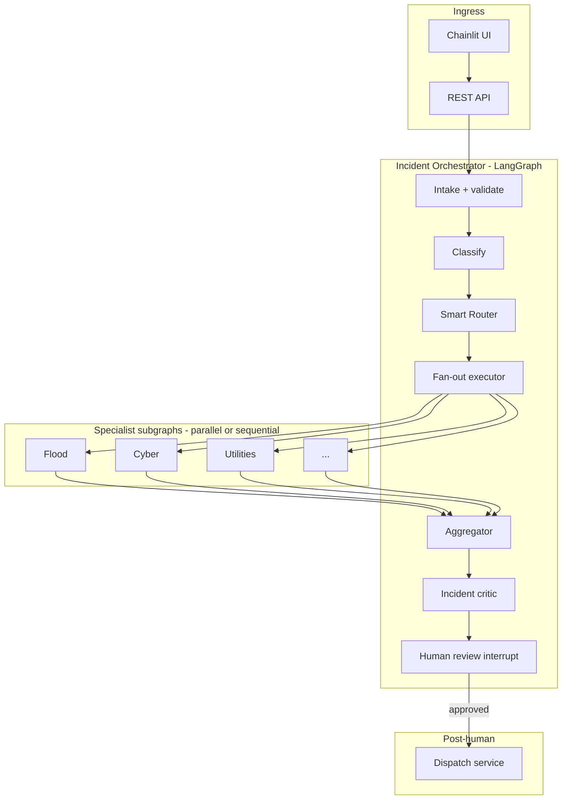
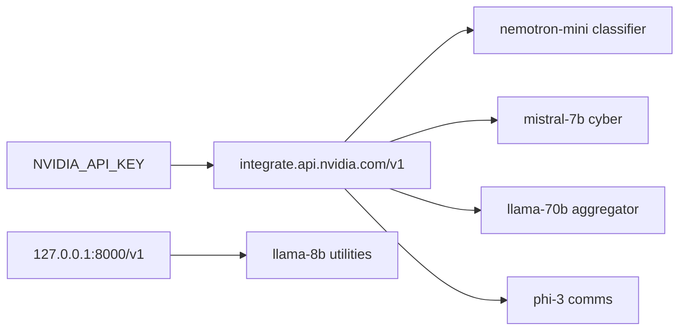
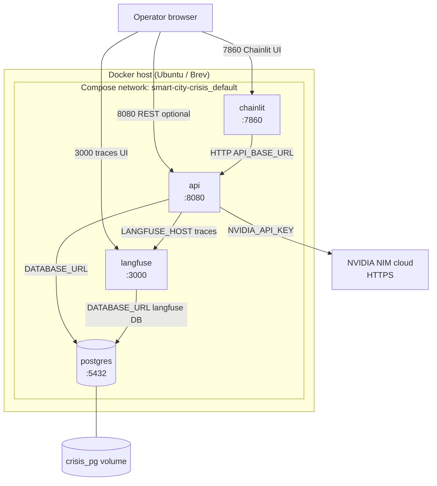
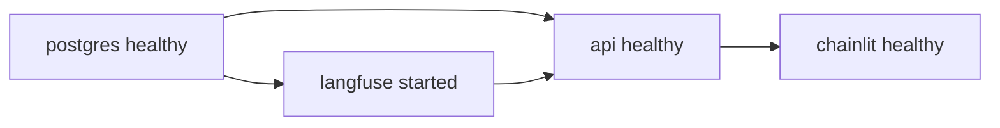

# Smart City Crisis Management AI — Technical Design

| Field | Value |
|-------|--------|
| **Version** | 1.0 |
| **Status** | Implemented (v1.0 application); see `docs/RUNBOOK_v1.md` |
| **Application** | `src/crisis/` v1.0.0 |
| **Primary OS** | Ubuntu 22.04+ (see `docs/UBUNTU.md`) |
| **Product** | Smart City Crisis Management System |
| **Requirements** | `.kiro/specs/smart-city-crisis-management/requirements.md` |
| **Stack** | LangGraph · NVIDIA NIM (cloud + optional local) · Langfuse · Chainlit |
| **Inference** | Per-agent models on NVIDIA cloud (`LLM_PROFILE=multimodel`); optional local via config |

---

## 1. Purpose

This document is the **build reference** for the Smart City Crisis Management application: a **human-in-the-loop**, multi-agent decision-support system for city emergency operations teams.

It consolidates product requirements, architecture decisions from design reviews, and patterns proven in prior work (LangGraph router→enrich→draft→critic, Plan–Guard–Act–Verify, NAT+NIM configs, RAG pipelines).

**Out of scope for v1.0 code:** autonomous dispatch; live SCADA/CAD integrations; NAT tool workflows; mid-workflow switch (P2).

### 1.1 v1.0 implementation scope

| Area | v1.0 status |
|------|-------------|
| Intake, classify (rules), Smart Router (rules) | Implemented |
| Multi-specialist fan-out (parallel/sequential) | Implemented |
| Per-agent workflow selection | Implemented |
| Aggregator + HITL (API + Chainlit) | Implemented |
| **Docker Compose stack** | **Mandatory** — `make start` |
| **PostgreSQL** | **Mandatory** in Docker — incident persistence |
| **Langfuse** | **Mandatory** in Docker — self-hosted v2 image |
| LLM | **`LLM_PROFILE=multimodel`** — NVIDIA cloud from containers |
| Host pytest | `make test` — mock LLM, no Docker |
| Local NIM | Optional — `local_*` profiles in YAML |

---

## 2. Goals and non-goals

### 2.1 Goals

- Accept incident reports (API + natural language), normalize and audit them.
- Classify incidents (category, severity, confidence).
- **Intelligently select** which specialist agents to run (one, several, or all *candidates*).
- Run **independent specialist subgraphs**, each choosing its own **workflow** and producing structured output.
- Aggregate outputs into one **Incident Summary** for a human operator.
- Require **explicit approval** before any external communication or action.
- Support **per-agent LLM configuration** (NVIDIA NIM cloud or local).
- Provide **full observability** and audit trail.

### 2.2 Non-goals (v1)

- Replacing human incident commanders or CAD systems.
- Hot-reload of `Agent_Config` / routing YAML without process restart (restart required; see §16).
- Mid-workflow switching inside a specialist run (deferred to **P2**; see §16).
- Unlimited parallel LLM agents on a single GPU (enforced caps).

---

## 3. Architecture overview

**Deployment containers (v1.0):** four Docker services (`postgres`, `langfuse`, `api`, `chainlit`) — roles, ports, and traffic flows are in **§12.2**.

### 3.1 Layered system

```text
┌─────────────────────────────────────────────────────────────────────────┐
│  Presentation: Chainlit ops UI + REST API clients                           │
├─────────────────────────────────────────────────────────────────────────┤
│  API Gateway: auth (RBAC), rate limits, incident CRUD                     │
├─────────────────────────────────────────────────────────────────────────┤
│  Incident Orchestrator (LangGraph):                                       │
│    Intake → Classify → Smart Router → Fan-out → Join → Aggregate →        │
│    Critic → Human Review (interrupt) → [Approved Dispatch]                │
├─────────────────────────────────────────────────────────────────────────┤
│  Specialist subgraphs (per agent):                                        │
│    Workflow Selector → Agent Workflow (actions/skills) → Checks → Output  │
├─────────────────────────────────────────────────────────────────────────┤
│  Platform: Skills registry · Knowledge Base · NAT runners · NIM clients   │
├─────────────────────────────────────────────────────────────────────────┤
│  Observability: Langfuse · audit store · health endpoints                 │
└─────────────────────────────────────────────────────────────────────────┘
```

### 3.2 End-to-end flow



### 3.3 Design principles

| Principle | Implementation |
|-----------|----------------|
| Human decision maker | No outbound dispatch without approval |
| Rules before LLM | Router, classifier hints, workflow selection |
| Evidence-bound outputs | Citations from tool/KB results required |
| Separation of concerns | Smart Router = *who*; Agent = *how* |
| Fail partial, not silent | Aggregator includes failed/timed-out agents |
| Audit everything | Incident lifecycle + per-action traces |
| Dispatch isolation | Separate service + IAM from orchestrator |

---

## 4. Component specifications

### 4.1 Intake (service, not LLM agent)

**Responsibility:** Validate, normalize, assign `incident_id`, persist original report.

| Item | Detail |
|------|--------|
| Input | `IncidentReport` (JSON or NL parsed to JSON) |
| Required fields | `description` (non-empty), `location` (non-empty) |
| Output | `Incident` canonical object |
| SLA | Normalize within 5s (Req 1) |
| ID | System-generated, non-reusable unique ID (Req 1.5) |
| Failure | Queue + retry if classifier unavailable (Req 1.7) |

**Implementation:** FastAPI handler + Pydantic validation. No LLM on happy path.

### 4.2 Classifier (hybrid node)

**Responsibility:** Assign categories, severity, confidence, routing hints.

| Item | Detail |
|------|--------|
| Categories | `FLOOD`, `INFRASTRUCTURE`, `CYBER`, `PUBLIC_SAFETY`, `PUBLIC_SERVICES`, `UTILITIES`, `OTHER` |
| Severity | `LOW`, `MEDIUM`, `HIGH`, `CRITICAL` |
| Confidence | 0.0–1.0 per category |
| Low confidence | If all category confidence &lt; 0.6 → flag human before routing (Req 2.4) |
| Hints | Rule extractors: keywords (`dam`, `ransomware`, `hospital`), optional NER later |

**Pipeline:**

1. Rule-based pre-classification (fast, auditable).
2. Schema-constrained LLM classification when rules incomplete.
3. Log decision to observability platform (Req 2.6).

### 4.3 Smart Router (intelligent selection layer)

Sits **between** classifier and specialist fan-out. Answers: **which specialists to run** (one / several / all *candidates*).

#### 4.3.1 Two-stage routing

```text
Stage A (deterministic):  categories → Candidate_Set  (category_map + severity policy)
Stage B (smart):          Candidate_Set → Selected_Set (+ Deferred_Set, execution_mode)
```

#### 4.3.2 Selection modes

| Mode | When | Selected agents |
|------|------|-----------------|
| `minimal` | LOW severity or low confidence | 1 primary (+ optional comms on CRITICAL) |
| `targeted` | Clear domain signals | Subset of candidates |
| `full` | CRITICAL + multi-category + confidence ≥ threshold | All candidates + comms |
| `override` | Human operator | Explicit list |

#### 4.3.3 Decision algorithm

```text
1. candidates ← category_map(incident.categories)
2. candidates ← candidates ∪ always_for_severity(incident.severity)
3. Apply dependency_rules(incident) → may add/remove from candidates
4. If confidence < 0.6:
     selected ← [primary_agent]; flag_human; mode ← minimal
   Else if severity == CRITICAL and meets full_activation_criteria:
     selected ← candidates; mode ← full
   Else if dependency_rules produced explicit set:
     selected ← rule_result; mode ← targeted
   Else:
     selected ← llm_router_select(candidates)  # schema enum subset only
5. Apply max_parallel_agents cap
6. deferred ← candidates - selected
7. Emit RoutingDecision (audit)
```

**Safety:** `PUBLIC_SAFETY` in candidates cannot be dropped by LLM (Req alignment). `workflow_override` from human forces agent list.

See `configs/smart_routing/` for rule and dependency examples.

### 4.4 Fan-out executor

**Responsibility:** Invoke each selected specialist subgraph with a `RouterHandoff`.

| Execution | Policy |
|-------------|--------|
| `parallel` | CRITICAL default; independent domains |
| `sequential` | LOW/MEDIUM or dependency chain; pass `prior_outputs` to later agents |

**LangGraph:** Use dynamic `Send` API — one send per `agent_id` in `Selected_Set`.

**Timeouts:** Per-agent (45–60s per requirements); one retry (Req 15); then `status: timeout|failed`.

### 4.5 Specialist agent (subgraph)

Each specialist is a **LangGraph subgraph**, not a single prompt.

#### 4.5.1 Internal flow

```text
START → select_workflow → run_workflow → agent_checks → package_output → END
```

| Step | Description |
|------|-------------|
| `select_workflow` | Agent chooses `workflow_id` from `RouterHandoff` (rules-first, optional LLM) |
| `run_workflow` | Execute configured actions (tools, rules, LLM, NAT) |
| `agent_checks` | Schema, citations, policy (stricter for PUBLIC_SAFETY) |
| `package_output` | Emit `SpecialistOutput` JSON |

#### 4.5.2 Router handoff contract

```python
class RouterHandoff(BaseModel):
    incident_id: str
    categories: list[str]
    severity: SeverityLevel
    location: LocationRef
    description: str
    confidence: float
    routing_hints: list[str]
    priority: int | None
    prior_outputs: dict[str, SpecialistOutput]
    constraints: list[str]          # e.g. "restricted_mode"
    activated_reason: str
    workflow_override: str | None   # human only
```

#### 4.5.3 Agent workflow (roles, skills, actions)

Each agent defines:

- **Role** — organizational function (`flood_coordinator`, `cyber_lead`, …)
- **Skills** — registered capabilities (`weather_api`, `playbook_rag`, …)
- **Workflows** — named action pipelines (`flood_standard`, `flood_dam_breach`, …)
- **Actions** — steps: `tool`, `rule`, `llm`, `critic`, `parallel`, `nat_workflow`

Workflow selection:

```text
1. If workflow_override: use it
2. Else apply workflow_selector rules (hints, severity, prior_outputs)
3. Else optional LLM selector (enum of registered workflow_ids only)
4. If confidence < 0.6: default workflow + flag
```

See `configs/agents/*.yaml` and `docs/schemas/AGENT_WORKFLOW.md` (inline below §6).

#### 4.5.4 Specialist catalog

| agent_id | Role | Example workflows |
|----------|------|-------------------|
| `flood` | flood_coordinator | `flood_light`, `flood_standard`, `flood_critical`, `flood_dam_breach` |
| `infrastructure` | infra_duty_officer | `infra_asset_failure`, `infra_cascade` |
| `cyber` | cyber_lead | `cyber_containment`, `cyber_recon` |
| `utilities` | utilities_dispatcher | `water_main_break`, `utilities_hospital_priority` |
| `public_services` | service_continuity_lead | `service_disruption_standard` |
| `public_safety` | eoc_safety_liaison | `public_safety_restricted` (templates/rules only) |
| `comms` | comms_officer | `citizen_alert`, `inter_agency_brief` |
| `general` | fallback_analyst | `general_triage` |

#### 4.5.5 Specialist output contract

```python
class SpecialistOutput(BaseModel):
    agent_id: str
    workflow_id: str
    workflow_selection_rationale: str
    recommendations: list[Recommendation]
    communication_drafts: list[CommunicationDraft]
    evidence: list[Evidence]
    checks_passed: bool
    check_notes: list[str]
    confidence: float
    duration_ms: int
    status: Literal["complete", "partial", "failed", "timeout"]
```

`Recommendation` and `CommunicationDraft` must reference `evidence_ids` where factual claims are made.

### 4.6 Aggregator

**Responsibility:** Fan-in all `SpecialistOutput` → single `IncidentSummary`.

| Behavior | Detail |
|----------|--------|
| Merge | Rank recommendations by severity + confidence |
| Conflicts | Detect contradictory actions (e.g. evacuate vs keep road open) |
| Partial | Include failed agents explicitly (Req 10.4) |
| Comms | Optionally invoke `comms` agent workflow on merged facts |
| SLA | Present within 10s of last agent completion (Req 10.3) |

### 4.7 Incident critic (verifier node)

**Responsibility:** Policy check on aggregated summary before human review.

- Required sections present
- No uncited critical claims
- PUBLIC_SAFETY wording matches template policy
- Max 2 revision loops → finalize with disclaimer if still failing

*Pattern:* hackathon `node_critic` + `nvidia-log-rca` grade step.

### 4.8 Human-in-the-loop

**LangGraph:** `interrupt_before = ["human_review"]`

| Operator action | System behavior |
|-----------------|-----------------|
| Approve recommendation | Audit timestamp + operator ID (Req 11.2) |
| Reject | Record reason; optional re-run request (Req 11.3) |
| Edit comms draft | Store original + modified (Req 11.4) |
| Approve dispatch | Hand off to Dispatch Service only |

**UI:** Elapsed timer since incident created (Req 11.6).

### 4.9 Dispatch service (isolated)

Separate module/service. Accepts only **signed, human-approved** payloads.

- Adapters: email, SMS gateway, ticketing (stubs in MVP)
- No direct LangGraph → external API path

### 4.10 Escalation

| Trigger | Behavior |
|---------|----------|
| Specialist requests escalation | Re-enter Smart Router with `prior_outputs` |
| Dependency rule | Activate deferred agent |
| Depth cap | Max 3 escalation chains (Req 14.3) |
| Human notify | Reason + newly activated agents (Req 14.4) |

---

## 5. Data models

### 5.1 Core types

```python
class SeverityLevel(str, Enum):
    LOW = "LOW"
    MEDIUM = "MEDIUM"
    HIGH = "HIGH"
    CRITICAL = "CRITICAL"

class Category(str, Enum):
    FLOOD = "FLOOD"
    INFRASTRUCTURE = "INFRASTRUCTURE"
    CYBER = "CYBER"
    PUBLIC_SAFETY = "PUBLIC_SAFETY"
    PUBLIC_SERVICES = "PUBLIC_SERVICES"
    UTILITIES = "UTILITIES"
    OTHER = "OTHER"

class IncidentReport(BaseModel):
    description: str
    location: str
    reporter: str | None = None
    channel: str | None = None
    attachments: list[str] = []

class Incident(BaseModel):
    incident_id: str
    description: str
    location: LocationRef
    categories: list[Category]
    severity: SeverityLevel
    confidence: float
    routing_hints: list[str]
    created_at: datetime
    original_report: IncidentReport
    status: IncidentStatus

class RoutingDecision(BaseModel):
    incident_id: str
    candidates: list[str]
    selected: list[str]
    deferred: list[str]
    selection_mode: Literal["minimal", "targeted", "full", "override"]
    execution_mode: Literal["parallel", "sequential"]
    rationale: str
    confidence: float

class IncidentSummary(BaseModel):
    incident_id: str
    categories: list[Category]
    severity: SeverityLevel
    agent_outputs: dict[str, SpecialistOutput]
    ranked_recommendations: list[Recommendation]
    communication_drafts: list[CommunicationDraft]
    conflicts: list[ConflictNote]
    agents_failed: list[str]
    ready_for_human_review: bool
```

### 5.2 Incident graph state (LangGraph)

```python
class IncidentState(TypedDict, total=False):
    incident: Incident
    routing_decision: RoutingDecision
    specialist_outputs: dict[str, SpecialistOutput]
    incident_summary: IncidentSummary
    human_decision: HumanDecision | None
    escalation_depth: int
    trace: list[str]
```

---

## 6. Agent workflow schema

### 6.1 Action types

| type | Purpose |
|------|---------|
| `tool` | Invoke skill from registry |
| `rule` | Deterministic if/then |
| `llm` | Schema-bound generation (`output_schema` required) |
| `critic` | Validate prior LLM output vs evidence |
| `parallel` | Run branches concurrently |
| `nat_workflow` | Delegate tool-heavy slice to NAT YAML |

### 6.2 Example agent config (excerpt)

```yaml
# configs/agents/flood.yaml
agent_id: flood
role: flood_coordinator

llm:
  provider: nim
  base_url: ${NIM_BASE_URL}
  model: meta/llama-3.1-8b-instruct

workflow_selection:
  mode: hybrid
  default: flood_standard
  rules_file: flood_selector_rules.yaml

workflows:
  flood_standard:
    actions:
      - { id: kb, type: tool, skill: playbook_rag, params: { tags: [flood] } }
      - { id: weather, type: tool, skill: weather_api }
      - { id: analyze, type: llm, skill: draft_recommendation, output_schema: FloodAnalysisOutput }
      - { id: verify, type: critic, rules: [require_citations] }
```

### 6.3 Skills registry

Central `configs/skills/registry.yaml` maps skill IDs to handlers, timeouts, and `allowed_roles`.

---

## 7. LangGraph implementation

### 7.1 Graph structure

```text
incident_graph:
  nodes:
    - intake_validate
    - classify
    - smart_route
    - fan_out_agents      # dynamic Send
    - join_agent_results
    - aggregate
    - incident_critic
    - human_review        # interrupt
    - dispatch            # only on resume with approval
  edges:
    intake_validate → classify → smart_route → fan_out_agents
    fan_out_agents → join_agent_results → aggregate → incident_critic → human_review
    human_review → dispatch | END
```

### 7.2 Specialist subgraph template

```text
specialist_subgraph(agent_id):
  select_workflow → run_workflow → agent_checks → package_output
```

Pre-compile subgraphs per `agent_id` at startup; workflow body loaded from YAML or embedded Python for MVP.

### 7.3 Checkpointing

- **Store:** PostgreSQL or Redis (LangGraph checkpointer)
- **Key:** `thread_id = incident_id`
- **Resume:** After partial failure or process restart (Req 15.4)

### 7.4 Streaming

- API exposes SSE/WebSocket for ops console
- Stream events: `classified`, `routed`, `agent_started`, `agent_completed`, `summary_ready`, `awaiting_human`
- *Pattern:* `nvidia-log-rca-nim` FastAPI streaming

---

## 8. NVIDIA stack integration

### 8.1 NIM (inference)

- Client: `langchain_nvidia_ai_endpoints.ChatNVIDIA`
- Endpoints:
  - **Cloud (primary):** `https://integrate.api.nvidia.com/v1` + `NVIDIA_API_KEY`
  - **Local (optional):** `http://127.0.0.1:8000/v1` on GPU instance (typically one small NIM)
- Per-agent `Agent_Config`: `base_url`, `model_name`, temperature, max tokens (see `configs/llm/multimodel.yaml`)
- **Same cloud API, different models per agent:** one `NIM_CLOUD_BASE_URL` + one `NVIDIA_API_KEY`; each agent gets its own `ChatNVIDIA(model=...)` instance.

#### 8.1.1 Inference architecture (decided)

The application runs on an **NVIDIA GPU instance** (P1+) for LangGraph, Chainlit, Langfuse, and Postgres. **LLM inference** uses **NVIDIA cloud** with a **different model per agent** on the same API endpoint. Optionally, **one small local NIM** on the instance serves agents assigned to the local endpoint (multi-endpoint deployment).

**Cloud — per-agent models (same `base_url`, different `model_name`):**

| Agent / role | Cloud model (example) | Rationale |
|--------------|----------------------|-----------|
| Classifier, router LLM, workflow selector | `nvidia/nemotron-mini-4b-instruct` | Fast, low cost |
| Flood, infrastructure, public_safety | `meta/llama-3.1-8b-instruct` | General specialist |
| Cyber | `mistralai/mistral-7b-instruct-v0.3` | Domain-tuned model choice |
| Public services, comms | `microsoft/phi-4-mini-instruct` | Shorter drafts |
| **Aggregator** | `meta/llama-3.1-70b-instruct` | Highest quality merge |
| Incident critic | `meta/llama-3.1-8b-instruct` | Consistent verification |
| Embeddings (RAG, future) | `nvidia/nv-embed-v1` | Not wired in v1.0; optional on build.nvidia.com |

**Local — optional second endpoint:**

| Agent | Endpoint | Model |
|-------|----------|-------|
| Utilities (configurable) | `http://127.0.0.1:8000/v1` | `meta/llama-3.1-8b-instruct` |

Configure assignments in `configs/llm/multimodel.yaml`. Model IDs must be enabled on your NVIDIA API account.

**Observability:** Langfuse spans tag `agent_id`, `llm_provider` (`cloud`|`local`), and `model_name` per invocation.

**GPU instance:** hosts the application stack and optional local 8B NIM; large models (e.g. 70B aggregator) stay on cloud unless explicitly moved local.

**Per-agent override:** `configs/agents/<agent>.yaml` may set `llm.profile` or inline `llm.model` to override the global assignment map.

#### 8.1.2 Optional air-gapped / full-local deployment

For environments that cannot use cloud inference, add a second LLM profile (e.g. `configs/llm/local_only.yaml`) mapping most agents to local NIM endpoints and a dedicated 70B NIM or burst policy for the aggregator.

#### 8.1.3 LLM registry (implementation)

Load `configs/llm/<LLM_PROFILE>.yaml` at startup (restart on change — O4). Build a cache of clients keyed by `profile_id`:

```python
def get_llm(agent_id: str, role: str = "agent") -> ChatNVIDIA:
    profile = resolve_profile(agent_id, role)  # assignments + agent yaml override
    return ChatNVIDIA(
        model=profile.model,
        base_url=profile.base_url,
        api_key=os.environ["NVIDIA_API_KEY"],
        temperature=profile.temperature,
    )
```

Log and trace every invoke: `agent_id`, `profile_id`, `base_url`, `model`.



### 8.2 NAT (tools / RAG)

Use NAT for **tool-rich** workflow actions (e.g. cyber `react_agent` with playbook RAG).

```yaml
# configs/nat/cyber_react.yml
workflow:
  _type: react_agent
  tool_names: [playbook_rag, asset_inventory_stub]
  llm_name: cyber_llm
```

Invoke from LangGraph `nat_workflow` action via in-process runner or `nat run` subprocess (Phase 2).

### 8.3 Prior art mapping

| Pattern | Source project | Use here |
|---------|----------------|----------|
| router → enrich → draft → critic | `hackthon/example_langgraph_nim` | Specialist workflow |
| Plan → Guard → Act → Verify | hackathon `orchestrator.py` | Tool allowlist |
| retrieve → rerank → grade → generate | `nvidia-log-rca-nim` | KB actions in agents |
| NAT YAML + NIM | hackathon `nim_local.yml` | Per-agent NAT steps |

---

## 9. Observability and audit

### 9.1 Observability platform — Langfuse (decided)

**Default:** [Langfuse](https://langfuse.com/) (self-hostable, OpenTelemetry-friendly).

Langfuse integrates cleanly with the stack via LangChain/LangGraph callbacks (`langfuse` Python SDK + `LANGFUSE_*` env vars). No custom tracing layer required for MVP.

| Integration | Approach |
|-------------|----------|
| LangGraph / LangChain | `LangfuseCallbackHandler` on graph invoke |
| FastAPI | Optional OTEL exporter → Langfuse |
| Dev | Langfuse in `docker-compose.yml` |

Disable tracing in tests with `LANGFUSE_ENABLED=false`. LangSmith is not a target for v1; add later only if a hard requirement appears.

| Signal | Tags |
|--------|------|
| Trace root | `incident_id`, `severity` |
| Smart Router span | `selection_mode`, `selected`, `deferred` |
| Agent span | `agent_id`, `workflow_id` |
| Action span | `action_id`, `skill` |

### 9.2 Audit log

Persist lifecycle events (Req 13):

`created` → `classified` → `routed` → `agent_started` → `agent_completed` → `aggregated` → `human_approved|rejected` → `dispatched`

Retention: 90 days minimum (Req 13.4).

### 9.3 Evaluations

`evals/cases.yaml` — incident scenarios with expected substrings and JSON schema checks. Run in CI on prompt/model changes.

### 9.4 Health

`GET /health` — orchestrator, checkpointer, NIM endpoints, per-agent registry load status.

---

## 10. Security and governance

| Area | Control |
|------|---------|
| AuthN/Z | RBAC: dispatcher, comms officer, admin |
| PUBLIC_SAFETY | `restricted_mode`: template/rule actions only |
| PII | Redact before cloud fallback LLM |
| Tool guard | Skill allowlist per role |
| Kill switch | Disable AI suggestions; rule-only triage |
| Audit | Immutable append-only log for decisions |
| Simulation | `SIMULATION_MODE` — no real dispatch |

---

## 11. Resilience

| Scenario | Behavior |
|----------|----------|
| Agent timeout | Retry once → partial summary (Req 15) |
| Agent hard fail | Continue with others |
| Classifier down | Intake queue + retry (Req 1.7) |
| NIM down | Degraded: rules-only classify/route; queue LLM steps |
| Process crash | Resume from checkpointer |

---

## 12. Deployment

### 12.1 Reference topology

```text
[Operators] → [Chainlit UI] ──┐
                               ├──→ [API + LangGraph] → [Langfuse]
[API clients] ────────────────┘           ↓
            [Postgres: incidents + audit + checkpoints]
                                          ↓
            [Vector DB: Knowledge Base]   [NIM fleet local/cloud]
```

### 12.2 Docker Compose containers (v1.0)

v1.0 runs as **four containers** on a single Docker host (`docker compose up`, `make start`). There is **no separate NIM container** in the default stack — the `api` service calls **NVIDIA cloud** over HTTPS (`integrate.api.nvidia.com`). Optional local NIM is documented in §8.1.2 and runs outside this compose file if needed.

#### 12.2.1 Container map



#### 12.2.2 Container roles

| Container | Image | Port (host) | Role in application design |
|-----------|--------|-------------|----------------------------|
| **postgres** | `postgres:16-alpine` | 5432 | **Persistence layer.** Database `crisis` stores incidents, decisions, and audit fields written by the API. Second logical DB `langfuse` (created by init script) stores Langfuse metadata. Survives restarts via volume `crisis_pg`. |
| **langfuse** | `langfuse/langfuse:2` | 3000 | **Observability platform (O1).** Self-hosted trace UI and ingestion API. Operators create a project and API keys here; keys go in `.env` so the **api** process can emit LangGraph/LLM spans. Does not run agents or business logic. |
| **api** | `smart-city-crisis-app:1.0` (built locally) | 8080 | **Core application runtime.** FastAPI + LangGraph incident orchestrator: intake, classify, Smart Router, specialist fan-out, aggregate, critic. Reads `configs/` and `data/` (mounted read-only). Persists to Postgres. Calls NVIDIA cloud per `LLM_PROFILE`. Exposes `/health`, `/incidents`, decision endpoints. |
| **chainlit** | `smart-city-crisis-app:1.0` (same image, different command) | 7860 | **Operator console (O2).** Thin presentation tier: chat UI, demo starters, approve/reject actions. Forwards incident text to **api** via `API_BASE_URL=http://api:8080`. Does not call LLMs or Postgres directly. |

**Shared image:** `api` and `chainlit` use one Dockerfile (`smart-city-crisis-app:1.0`). Only the container **command** differs (uvicorn vs `chainlit run`). Rebuild with `make build` after code or dependency changes.

#### 12.2.3 Startup order and health



| Step | Condition | Why |
|------|-----------|-----|
| 1 | `postgres` healthy (`pg_isready`) | Langfuse and API need a database |
| 2 | `langfuse` started | API enables tracing when `LANGFUSE_ENABLED=true` |
| 3 | `api` healthy (`GET /health`) | Chainlit depends on backend for every incident |
| 4 | `chainlit` healthy (`GET /project/settings`) | UI ready when settings JSON returns 200 |

#### 12.2.4 Traffic and trust boundaries

```text
┌──────────────────────────────────────────────────────────────────────────┐
│  External (operator laptop via port-forward / SSH tunnel)                 │
│    :7860 Chainlit  :8080 API  :3000 Langfuse                              │
└───────────────────────────────┬──────────────────────────────────────────┘
                                │
┌───────────────────────────────▼──────────────────────────────────────────┐
│  chainlit          Presentation only — no .env secrets for Langfuse/DB    │
│       │ HTTP (internal DNS: api:8080)                                     │
│       ▼                                                                   │
│  api               Business logic + LangGraph + LLM egress to NVIDIA      │
│       │                    │                                              │
│       │                    └──► https://integrate.api.nvidia.com/v1       │
│       ├──► postgres:5432/crisis                                           │
│       └──► langfuse:3000 (trace ingest)                                   │
│                                                                           │
│  langfuse          Auth UI + trace store — uses postgres DB `langfuse`    │
│  postgres          Single engine, two databases (crisis + langfuse)       │
└──────────────────────────────────────────────────────────────────────────┘
```

| Boundary | Rule |
|----------|------|
| Operator → Chainlit | Browser only; simulation mode blocks real dispatch at API layer |
| Chainlit → API | Server-side HTTP on compose network; no direct DB access |
| API → Postgres | `DATABASE_URL`; incident CRUD and status |
| API → Langfuse | Optional until `LANGFUSE_PUBLIC_KEY` / `SECRET_KEY` set; app runs without traces |
| API → NVIDIA | Outbound HTTPS; `NVIDIA_API_KEY` from `.env` (api service only) |

#### 12.2.5 Config and data mounts (api container)

| Mount | Purpose |
|-------|---------|
| `./configs` → `/app/configs` | Smart routing, per-agent workflows, `LLM_PROFILE` YAML |
| `./data` → `/app/data` | Knowledge base, utilities catalog, `data/examples/` demo incidents |
| `.env` (compose `env_file`) | Secrets and feature flags for **api** only |

Chainlit receives only `API_BASE_URL`, `CHAINLIT_URL`, and `PYTHONUNBUFFERED` — not the full `.env` — to avoid breaking the Chainlit settings endpoint.

#### 12.2.6 Optional components (not in default compose)

| Component | v1.0 | Notes |
|-----------|------|-------|
| **Local NIM** | Optional | Separate GPU process or container on `:8000`; map via `configs/llm/local.yaml` |
| **Vector DB** | Future | Knowledge base today is file-based under `data/` |
| **NAT runner** | P3 | Tool workflows; not in v1.0 compose |

See `docs/DOCKER.md` and `docker-compose.yml` for ports, health checks, and operations.

### 12.3 Environments

| Env | Purpose |
|-----|---------|
| `dev` | Synthetic data, simulation mode |
| `staging` | Integrations stubs + eval suite |
| `prod` | Real adapters, strict RBAC |

---

## 13. Repository structure

```text
hkteam/
  README.md
  docs/
    TECHNICAL_DESIGN.md          # this document
  .kiro/specs/.../requirements.md
  configs/
    agents/                      # per-agent workflow + LLM
    llm/                         # multimodel.yaml — per-agent cloud/local profiles
    smart_routing/               # category_map, dependencies, caps
    skills/registry.yaml
    nat/                           # optional NAT workflows
  data/                            # synthetic incidents, KB, catalogs
  src/
    api/                           # FastAPI routes, SSE
    ui/                            # Chainlit app (operator console)
    graph/
      incident_graph.py
      nodes/                       # classify, smart_route, aggregate, ...
      specialists/                 # subgraph per agent_id
    models/                        # Pydantic schemas
    skills/                        # tool implementations
    observability/
    dispatch/                      # isolated dispatch adapters
  evals/
    cases.yaml
  tests/
  docker-compose.yml
  pyproject.toml
```

---

## 14. Implementation phases

| Phase | Deliverable | Requirements |
|-------|-------------|--------------|
| **P0 — Spine** | Intake API, classify, smart route (rules only), 1 specialist (`utilities`), aggregate, **Chainlit** HITL (approve/reject) | 1, 2, 3, 8, 10, 11 |
| **P1 — Multi-agent** | 3 specialists, parallel fan-out, workflow selector, critic, **Langfuse** wired, partial failure | 3–6, 13, 15 |
| **P2 — Full domain** | All specialists, PUBLIC_SAFETY restricted, escalation, checkpointer, comms agent, **mid-workflow switch** (optional) | 7, 9, 14 |
| **P3 — Production** | NAT tools, real adapters, 90-day audit, eval CI, multi-NIM; config changes via **restart** | 12, 13 |

---

## 15. Requirements traceability (summary)

| Req | Topic | Design section |
|-----|-------|----------------|
| 1 | Ingestion | §4.1 |
| 2 | Classification | §4.2 |
| 3 | Routing | §4.3, §4.4 |
| 4–9 | Specialists | §4.5 |
| 10 | Aggregation | §4.6 |
| 11 | HITL | §4.8 |
| 12 | Per-agent LLM | §8.1, §6 |
| 13 | Observability | §9 |
| 14 | Escalation | §4.10 |
| 15 | Resilience | §11 |

---

## 16. Resolved decisions

| ID | Decision | Choice | Notes |
|----|----------|--------|-------|
| **O1** | Observability platform | **Langfuse** | LangChain/LangGraph callback integration; self-host via Docker Compose |
| **O2** | Operator UI | **Chainlit** | Incident submit, summary review, approve/reject in P0 |
| **O3** | Mid-workflow switch | **Defer to P2** | Specialist may change `workflow_id` mid-run after new evidence (max one switch) |
| **O4** | Agent_Config reload | **Restart** | YAML/config changes require process restart; no hot-reload in v1–P3 |
| **O5** | Inference topology | **Per-agent cloud models + optional local 8B** | Same cloud URL; different `model_name` per agent; selected agents on local NIM |

**O1 env (typical):** `LANGFUSE_PUBLIC_KEY`, `LANGFUSE_SECRET_KEY`, `LANGFUSE_HOST` (e.g. `http://localhost:3000`).

**O5 env (typical):** `NVIDIA_API_KEY`, `NIM_CLOUD_BASE_URL`, `NIM_LOCAL_BASE_URL`, `LLM_PROFILE=multimodel` — see `.env.example`.

**O4 operational note:** Use container/process restart or rolling deploy in Kubernetes; document config mount paths in runbooks.

**O5 note:** Per-agent models are defined in `configs/llm/multimodel.yaml`. Run local 8B NIM only for agents assigned a `local_*` profile (default: `utilities`).

---

## 17. Glossary (extended)

| Term | Definition |
|------|------------|
| **Smart Router** | Selects subset of specialists from candidates |
| **Candidate_Set** | Agents eligible from categories |
| **Selected_Set** | Agents actually executed |
| **RouterHandoff** | Payload from orchestrator to specialist |
| **Agent Workflow** | Named sequence of actions for a role |
| **Workflow Selector** | Chooses workflow_id inside specialist |
| **Skill** | Registered tool capability |
| **Deferred agent** | Candidate not run in pass 1; may activate on escalation |

---

## 18. References

- Product requirements: `.kiro/specs/smart-city-crisis-management/requirements.md`
- Example configs: `configs/` in this repository
- External: [NVIDIA NIM](https://build.nvidia.com/), [NeMo Agent Toolkit](https://github.com/NVIDIA/NeMo-Agent-Toolkit), [LangGraph](https://langchain-ai.github.io/langgraph/)

---

*Document maintained by the hkteam project. Update version on significant design changes.*
