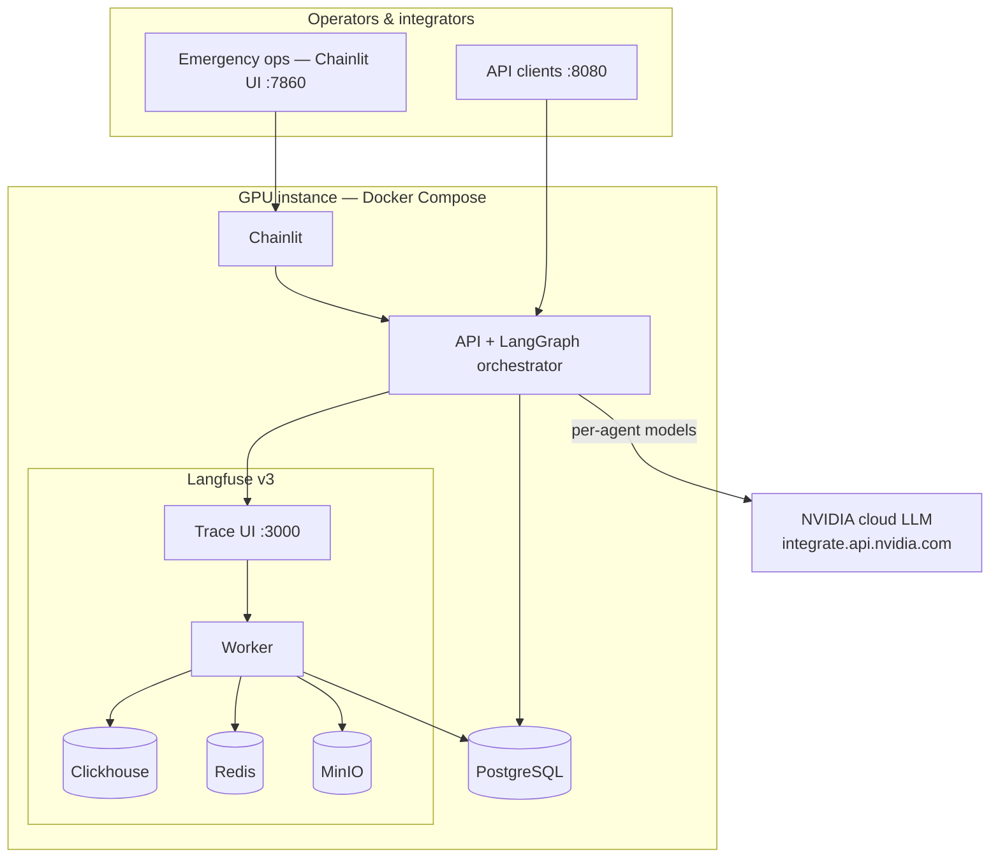
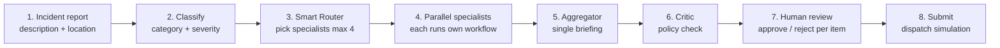
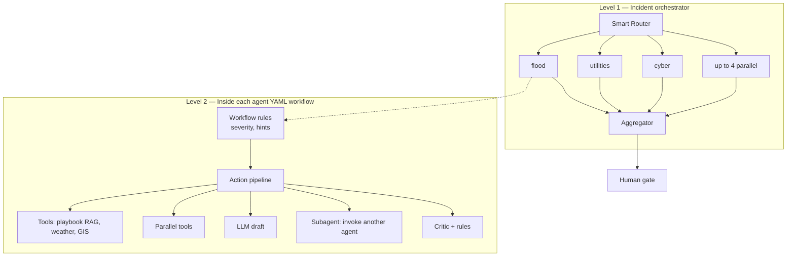

# Smart City Crisis Management AI — presentation (3 slides, ~5 min)

**Audience:** Stakeholders · **Runtime:** ~5 min (~90 sec/slide + optional demo)  
**Deploy:** NVIDIA GPU instance · Docker · NVIDIA cloud LLMs · Langfuse v3 traces

---

## Slide 1 — Platform architecture & components

### Headline
**Multi-agent crisis command center — human approval before any action**

### Value (one line)
Ingest incidents → domain AI specialists analyze in parallel → one briefing → operator approves → controlled dispatch.

### Architecture diagram

### Application components

| Component | Role |
|-----------|------|
| **Chainlit UI** | Operator console — submit incidents, live pipeline, approve/reject recommendations |
| **API + LangGraph** | Incident orchestrator — classify, route, fan-out agents, aggregate, critic |
| **Specialist agents (×8)** | Flood, utilities, cyber, infrastructure, comms, public safety, public services, general |
| **Workflow engine** | Per-agent YAML: tools, LLM, parallel steps, **child agents (subagents)** |
| **PostgreSQL** | Incidents, decisions, audit |
| **Langfuse v3** | Full LLM/agent traceability for compliance and tuning |
| **NVIDIA cloud** | Right-sized model per task (fast classify → specialist → 70B merge) |

**Speaker note:** Production container stack on customer GPU instance. Simulation mode for pilots; production dispatch adapters when required.

---

## Slide 2 — Application flow (end to end)

### Headline
**From report to decision in one controlled pipeline**

### Flow diagram

### What the operator sees

| Step | What happens |
|------|----------------|
| Submit | Natural-language report; location on last line |
| Command center | Live SSE progress — which agents are running |
| Recommendations | One card per action; **Approve** or **Reject** |
| Submit | Only approved items proceed; audit + trace in Langfuse |

### Safety by design

- No outbound action without **explicit Submit**
- `SIMULATION_MODE` for pilots; same flow for production adapters
- Every LLM call traced (agent, model, latency)

**Speaker note:** Example incident: flood + utilities — two agents, one consolidated briefing.

---

## Slide 3 — AI agent orchestration (core capability)

### Headline
**Two-level orchestration: who runs + how each agent thinks**

### Orchestration model

### Business value

| Capability | Meaning |
|------------|---------|
| **Configurable per agent** | Flood playbook ≠ cyber playbook — change YAML, not code |
| **Workflow per incident type** | e.g. `flood_critical` vs `flood_light` from rules |
| **Parallel tools + specialists** | Faster situational picture under time pressure |
| **Subagents** | e.g. flood workflow invokes **comms** for public alerts — composable expertise |
| **Model routing** | Cost/latency control: small models for routing, 70B only for merge |
| **Max 4 parallel agents** | Predictable load on the GPU instance |

### Example (say aloud)

> *"Dam breach"* → Router activates **flood** + **utilities** → flood runs `flood_dam_breach`: parallel weather/GIS → LLM recommendations → **subagent comms** for public messaging → aggregator produces one ranked briefing → operator approves line by line.

### Config surface

- `configs/agents/*.yaml` — workflows  
- `configs/smart_routing/` — who gets activated  
- `configs/llm/multimodel.yaml` — NVIDIA models per role  

**Speaker note:** Lead with orchestration — pilot on GPU instance in days; Langfuse traces for audit and model governance.

---

## 5-minute talk track

| Time | Slide | Focus |
|------|-------|--------|
| 0:00–1:30 | 1 | Architecture + components |
| 1:30–3:00 | 2 | Flow + human approval |
| 3:00–5:00 | 3 | Agent orchestration (+ optional live demo) |

## Optional live demo

1. Chainlit `:7860`  
2. Starter **flood + utilities**  
3. Pipeline → approve → Submit → dispatch simulation  

## Export to slides (PowerPoint / Google Slides)

1. Mermaid blocks → [mermaid.live](https://mermaid.live) → PNG/SVG  
2. One slide per `## Slide N` section  
3. Max 4–5 bullets per slide  
